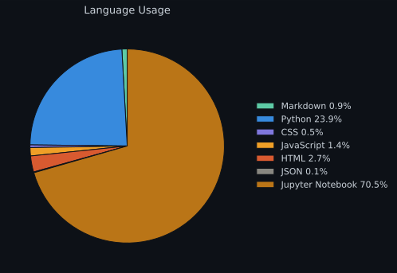
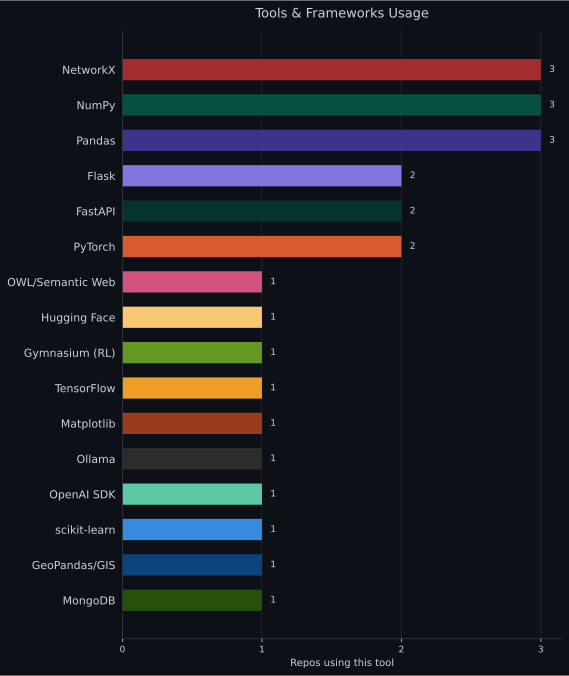

  
  
  
  
  

---

### 👋 About me

Hi, I'm Luca Giuliano, an AI Engineer just starting my journey. I'm passionate about exploring new technologies and diving into projects across AI/ML and GenAI.

---

### 🧰 Tech Stack

| Area | Tools |
|---|---|
| **Languages** | Python |
| **Semantic Web** | OWL 2 DL, RDF, SPARQL, `owlready2`, `owlrl`, `rdflib`, Protégé |
| **LLM / AI** | Ollama (local & cloud), Hugging Face `transformers`, `trl`, `peft`, `llama-cpp-python`, OpenAI SDK, CLIP, prompt engineering, multi-model orchestration |
| **ML / Deep Learning** | PyTorch, TensorFlow / Keras, scikit-learn, Reinforcement Learning (Gymnasium, DQN, PPO) |
| **Geospatial / GIS** | GeoPandas, Shapely, `pyproj`, `pyogrio`, NetworkX (graph pathfinding: Dijkstra, A*) |
| **Databases** | MongoDB (`pymongo`), NoSQL data modeling |
| **Backend / Web** | FastAPI, Flask, Uvicorn |
| **Tooling** | Git, Conda |

---

### 📌 Featured Projects

- 🐙 **[CulturalMonument-TBox](https://github.com/Kizorat/CulturalMonument-TBox)** — OWL 2 DL ontology for Florence's "Architettura e Monumenti" open dataset, reusing Italian semantic web vocabularies (ArCo, Cultural-ON, OntoPiA, GeoSPARQL) and enforcing database-style integrity constraints.
- 🐙 **[ContextWare](https://github.com/TheOverfitters/ContextWare)** — LLM-driven system for classifying GitHub code diffs into 16 semantic categories, with multi-model orchestration via Ollama and evaluation metrics.

### 🗂️ Other Projects

- 🐙 **[DeepFake](https://github.com/Kizorat/DeepFake)** — Binary classifier distinguishing real vs. AI-generated images using CLIP as a feature extractor, with a Triplet Loss architecture and SVM classification head, trained and evaluated on a dataset of ~2.5M images.
- 🐙 **[LearningGrid](https://github.com/Kizorat/LearningGrid)** — Research framework studying hybrid human-AI-style collaboration in MiniGrid RL environments, combining a DQN controller, an LLM-based planning helper, and a PPO-trained reviewer module, coordinated via the HeRoN architecture.
- 🐙 **[HeliPathGIS](https://github.com/Kizorat/HeliPathGIS)** — Web-based GIS for emergency route optimization in Lombardia, comparing ground (Dijkstra) and helicopter (A*) routes with no-fly zone constraints, built with FastAPI and an interactive Leaflet map interface.
- 🐙 **[KeybladeDB](https://github.com/Kizorat/KeybladeDB)** — Contributed to a Flask/MongoDB web app cataloguing video game data and rating trends over time, built for a Database Systems course.

---

### 📊 GitHub Stats

**📊 GitHub overview**

  

**💻 My language & tools usage**

<table align="center">
  <tr>
    <td align="center"></td>
    <td align="center"></td>
  </tr>
</table>

  

  

---

### 📫 Get in touch

  
  

